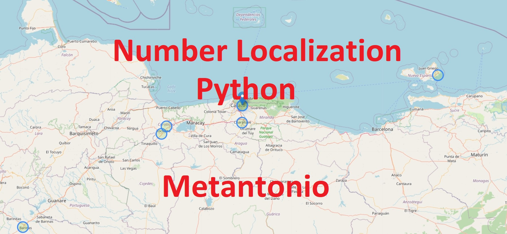

# Localizar número celular (no de manera exacta, la API es pública)
<!-- Sección portada del repositorio -->
<a href="#">
    
</a>
Este script en python se realizó para demostrar cómo usar la API de opencage.com, es una versión muy rústica de en la que se encuentra el número de celular a la antena de mejor senal de una operadora telefónica. 

Descargar los archivos en una misma carpeta.

## Qué se necesita si soy usuario de Windows?

Se necesita tener instalado Python 3.9 (preferiblemente), el cual puede descargarse desde la tienda oficial de Microsoft de forma gratuita.

- [Python 3.9](https://www.microsoft.com/store/productId/9P7QFQMJRFP7)


También es necesario instalar algunas dependencias de Python la primera vez para el correcto funcionamiento del script, para esto tan sólo se debe dar doble click al archivo: `instalar dependencias.bat`. Si por el contrario, se desean instalar las dependencias de Python de forma manual, es necesario ejecutar las siguientes líneas de código en el prompt (parece repetir, pero es una forma de evitar errores si hay más de una versión de python en el pc, o más de un usuario incluso en windows):

```sh
pipenv install
```

## Cómo ejecuto el script de Python?

Crear un archivo .env:

```sh
cp .env.example .env
```
Copia y pega tu API kEY de [OpenCageData](https://opencagedata.com/) en el archivo .env

En el archivo .env, agrega el número de celular en la variable 'Number'

Para ejecutar el script, se debe ejecutar un ambiente virtual, hay que abrir el prompt de Windows, navegar hasta la dirección en que están contenidos los archivos, y ejecutar:

```sh
pipenv shell
pipenv run numberLocation.py
```

El resultado se visualizará en el archivo Location.html, abrir desde cualquier navegador.

P.D: La idea inicial de crear este script, era localizar a las personas que se dedican a estafar por mensajería celular con el mensaje "hola soy María, este es mi nuevo número". 